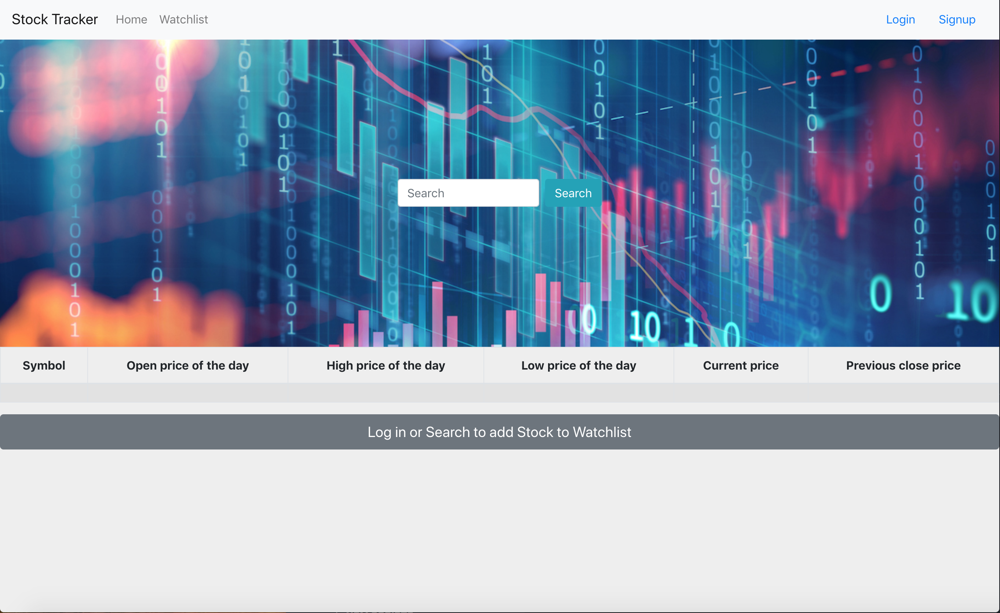
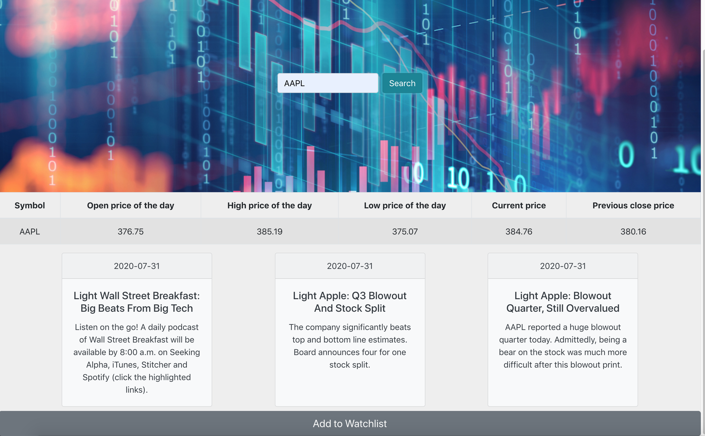
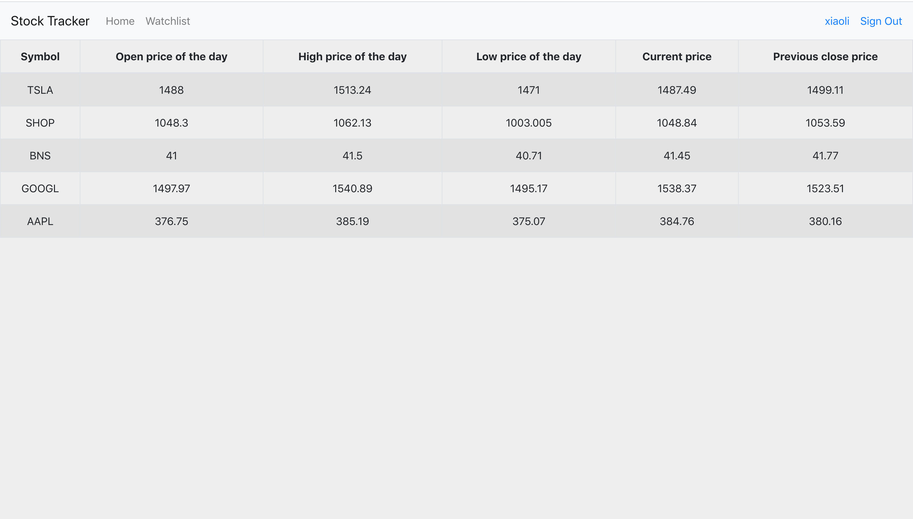

# Stock Tracker

## Background
----

Search the symbol for your stock. Help your to get its price information and news.
You can also store it in the watchlist to keep track your favourite stock information.

## Screen Shots
---

## Technology Used
---
- React
- Node.js
- Heroku
- Express
- JWT
- RESTFUL API
- MongoDB
- React Bootstrap
- Material-ui

----

## Getting Started

[Here is my App](https://simplystocktracker.herokuapp.com)

---

## Next Steps

- Make stock update in real time
- Have remove stock from watchlist, clear watchlist features
- Display news on watchlist
- Intergrate more stock API functions like foreign exchange, or graph/statistics